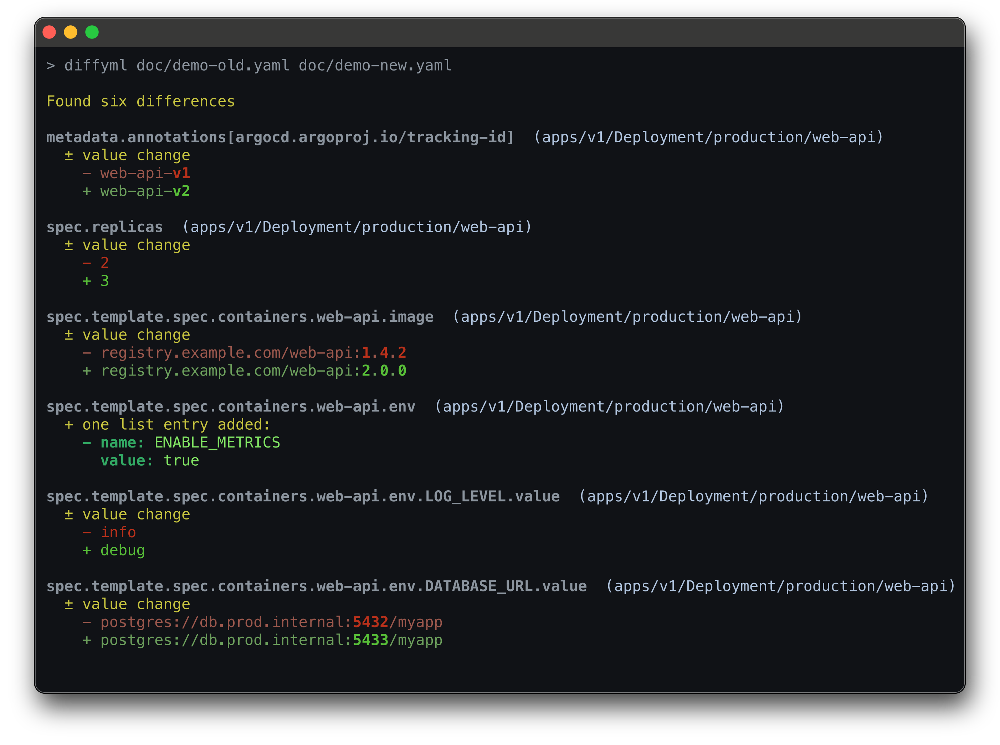
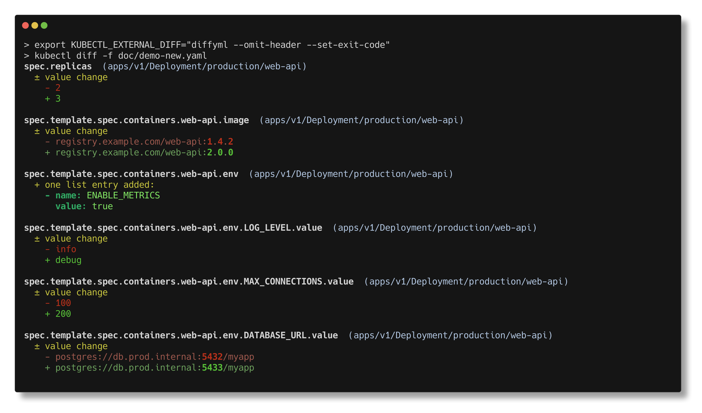

# diffyml

A fast, structural YAML diff tool with built-in Kubernetes intelligence. One dependency, minimal attack surface, native CI annotations for GitHub, GitLab, and Gitea.

[](https://scorecard.dev/viewer/?uri=github.com/szhekpisov/diffyml)
[](https://goreportcard.com/report/github.com/szhekpisov/diffyml)
[](https://pkg.go.dev/github.com/szhekpisov/diffyml)
[](https://codecov.io/gh/szhekpisov/diffyml)
[](https://github.com/szhekpisov/diffyml/releases/latest)
[](https://opensource.org/licenses/MIT)
[](https://github.com/szhekpisov/diffyml/actions/workflows/test.yml)
[](https://github.com/szhekpisov/diffyml/actions/workflows/security.yml)


diffyml compares YAML files and shows meaningful, structured differences — not line-by-line text diffs.

## Why diffyml?

**Fastest at scale.** 7.7x faster than [dyff](https://github.com/homeport/dyff) on 78 KB files, 21x faster on 780 KB files, with the lowest memory footprint among YAML-aware tools at scale. Near-linear scaling. See [PERFORMANCE.md](PERFORMANCE.md) for methodology and results.

**One dependency, zero surprises.** A single runtime dependency ([yaml.v3](https://github.com/yaml/go-yaml)) and pure Go stdlib. Minimal attack surface, auditable in minutes.

**Gets YAML right.** Dotted keys, type preservation, mixed-type lists, nil values — concrete edge cases other tools get wrong. diffyml treats YAML semantics as first-class, not an afterthought.

## How It Compares

| Feature | diffyml | dyff | plain `diff` |
|---------|---------|------|------------|
| YAML-aware (structural diff) | Yes | Yes | No (line-based) |
| Kubernetes resource matching | By apiVersion + kind + name | By document position | No |
| Rename detection | Yes (content similarity) | No | No |
| API version migration | Yes (`--ignore-api-version`) | No | No |
| CI annotation formats | 3 (GitHub, GitLab, Gitea) | 0 | 0 |
| Runtime dependencies | 1 (yaml.v3) | 20+ | 0 |
| Directory comparison | Yes | No | Yes |
| Performance (78 KB) | 20 ms | 156 ms (7.7x slower) | 7 ms |
| Performance (780 KB) | 151 ms | 3,213 ms (21x slower) | 45 ms |

Comparison based on dyff v1.9 and diffyml v1.5. See [PERFORMANCE.md](PERFORMANCE.md) for benchmark methodology. [Open an issue](https://github.com/szhekpisov/diffyml/issues) if anything is outdated.

## Kubernetes Intelligence

diffyml auto-detects Kubernetes resources and matches them by `apiVersion`, `kind`, and `metadata.name` — so diffs stay meaningful even when document order changes.

- **Rename detection** — detects renamed/moved resources by content similarity (e.g., kustomize `configMapGenerator` hash-suffix changes like `app-config-abc123` → `app-config-def456`) and shows field-level diffs instead of bulk add/remove
- **API migration support** — `--ignore-api-version` drops `apiVersion` from the matching key, so an upgrade from `apps/v1beta1` to `apps/v1` shows field-level diffs instead of a remove + add
- **Drop-in for kubectl** — compare two directories of YAML files and use as `KUBECTL_EXTERNAL_DIFF` with no extra setup

## Installation

### Homebrew

```bash
brew tap szhekpisov/diffyml
brew install diffyml
```

### Go Install

```bash
go install github.com/szhekpisov/diffyml@latest
```

Make sure `$GOPATH/bin` is in your `PATH`:

```bash
export PATH="$(go env GOPATH)/bin:$PATH"
```

### From Source

```bash
git clone https://github.com/szhekpisov/diffyml.git
cd diffyml
go build -o diffyml
```

### Verifying Releases

Every release includes cryptographic verification artifacts:

- **Checksums** (`checksums.txt`) — SHA256 hashes for all archives
- **Cosign signature** (`checksums.txt.sigstore.json`) — keyless Sigstore signature
- **SBOMs** (`*.spdx.json`) — SPDX Software Bill of Materials for each archive
- **SLSA provenance** — Level 3 provenance attestation

**Verify the checksums signature:**

```bash
cosign verify-blob checksums.txt \
  --bundle checksums.txt.sigstore.json \
  --certificate-identity-regexp 'https://github.com/szhekpisov/diffyml/' \
  --certificate-oidc-issuer 'https://token.actions.githubusercontent.com'

# Linux
sha256sum --check checksums.txt --ignore-missing
# macOS
shasum -a 256 --check checksums.txt --ignore-missing
```

**Verify SLSA provenance:**

```bash
gh attestation verify diffyml_<VERSION>_linux_amd64.tar.gz \
  --repo szhekpisov/diffyml
```

## Quick Start

```bash
# Compare two local files
diffyml old.yaml new.yaml

# Compare local file against a remote URL
diffyml local.yaml https://example.com/remote.yaml

# Use in CI — exit code 1 when differences found
diffyml -s deployment-old.yaml deployment-new.yaml

# Use as kubectl external diff provider:
export KUBECTL_EXTERNAL_DIFF="diffyml --omit-header --set-exit-code"
```



## Features

- **6 output formats** — detailed, compact, brief, GitHub, GitLab, Gitea
- **Path filtering** — include/exclude paths with exact match or regex
- **Remote files** — compare directly from HTTP/HTTPS URLs
- **Certificate inspection** — inspects and compares embedded x509 certificates
- **Chroot navigation** — focus comparison on a specific YAML subtree
- ⭐ **AI-powered summaries** ⭐ — natural language summaries of changes via Anthropic API

## Usage

```bash
diffyml [flags] <from> <to>
```

### Output Formats

| Format | Flag | Use case |
|--------|------|----------|
| detailed | `-o detailed` (default) | Human review — full context |
| compact | `-o compact` | Quick scan of changes |
| brief | `-o brief` | Summary only |
| github | `-o github` | GitHub Actions annotations |
| gitlab | `-o gitlab` | GitLab CI annotations |
| gitea | `-o gitea` | Gitea CI annotations |

### Kubernetes Support

Resources are auto-detected and matched by `apiVersion` + `kind` + `metadata.name`, so diffs stay meaningful even when document order changes.

**Rename detection** — when resources can't be matched by identifier (e.g., kustomize `configMapGenerator` hash-suffix changes like `app-config-abc123` → `app-config-def456`), diffyml pairs unmatched documents by content similarity (60% threshold) and shows field-level diffs instead of bulk add/remove. Disable with `--detect-renames=false`.

**API migration** — `--ignore-api-version` drops `apiVersion` from the matching key, so an upgrade from `apps/v1beta1` to `apps/v1` shows field-level diffs instead of a remove + add.

**Opt out** — `--detect-kubernetes=false` disables K8s-aware matching entirely and compares documents by position.

```bash
# Compare two Kubernetes manifests
diffyml manifests-v1.yaml manifests-v2.yaml

# API migration — match by kind + name only
diffyml --ignore-api-version manifests-v1.yaml manifests-v2.yaml

# Disable Kubernetes detection
diffyml --detect-kubernetes=false file1.yaml file2.yaml
```

### Directory Comparison

diffyml accepts two directories as positional arguments. It discovers all regular files in each directory (regardless of extension), matches them by filename, and shows aggregated differences. Files that cannot be parsed as YAML are silently skipped.

This makes diffyml a drop-in `KUBECTL_EXTERNAL_DIFF` provider — kubectl passes two temporary directories containing extensionless temp files (e.g. `apps.v1.Deployment.default.nginx`), and diffyml discovers them automatically:

```bash
export KUBECTL_EXTERNAL_DIFF="diffyml --omit-header --set-exit-code"
kubectl diff -f manifests/
```

### Filtering

```bash
# Show only changes under a specific path
diffyml --filter spec.replicas old.yaml new.yaml

# Exclude noisy paths
diffyml --exclude metadata.annotations old.yaml new.yaml

# Regex filtering
diffyml --filter-regexp 'spec\.containers\[.*\]\.image' old.yaml new.yaml
```

### CI Integration

Use `-s` / `--set-exit-code` to set the exit code based on differences:

| Exit code | Meaning |
|-----------|---------|
| `0` | No differences (or success without `-s`) |
| `1` | Differences detected (only with `-s`) |
| `255` | Error occurred |

```bash
diffyml -s before.yaml after.yaml || echo "Config drift detected"
```

### AI Summary

Generate a natural language summary of changes using the Anthropic API:

```bash
export ANTHROPIC_API_KEY="sk-ant-..."

# Append AI summary after the diff output
diffyml --summary old.yaml new.yaml

# Use with brief format — replaces brief output with AI summary
diffyml --summary -o brief old.yaml new.yaml

# Use a different model
diffyml --summary --summary-model claude-sonnet-4-5-20250514 old.yaml new.yaml
```

The summary is appended after the standard diff output. If the API call fails, a warning is printed to stderr and the diff output is preserved. The exit code is never affected by summary success or failure.

### All Flags

<details>
<summary>Complete flag reference</summary>

**Output**

| Flag | Description |
|------|-------------|
| `-o, --output <style>` | Output style: `detailed`, `compact`, `brief`, `github`, `gitlab`, `gitea` (default `detailed`) |
| `-c, --color <mode>` | Color usage: `always`, `never`, `auto` (default `auto`) |
| `-t, --truecolor <mode>` | True color (24-bit): `always`, `never`, `auto` (default `auto`) |
**Comparison**

| Flag | Description |
|------|-------------|
| `-i, --ignore-order-changes` | Ignore order changes in lists |
| `--ignore-whitespace-changes` | Ignore leading/trailing whitespace differences |
| `-v, --ignore-value-changes` | Show only structural changes, exclude value changes |
| `--detect-kubernetes` | Detect and match Kubernetes resources (default `true`) |
| `--detect-renames` | Detect renamed/moved Kubernetes resources by content similarity (default `true`) |
| `--ignore-api-version` | Ignore `apiVersion` when matching Kubernetes resources |
| `-x, --no-cert-inspection` | Disable x509 certificate inspection |
| `--swap` | Swap from/to files |

**Filtering**

| Flag | Description |
|------|-------------|
| `--filter <path>` | Include only differences at specified paths (repeatable) |
| `--exclude <path>` | Exclude differences at specified paths (repeatable) |
| `--filter-regexp <pattern>` | Filter using regular expressions (repeatable) |
| `--exclude-regexp <pattern>` | Exclude using regular expressions (repeatable) |
| `--additional-identifier <field>` | Additional field for list item identification |

**Display**

| Flag | Description |
|------|-------------|
| `-b, --omit-header` | Omit summary header |
| `-g, --use-go-patch-style` | Use Go-Patch style paths |
| `--multi-line-context-lines <int>` | Context lines for multi-line strings (default `4`) |

**Chroot**

| Flag | Description |
|------|-------------|
| `--chroot <path>` | Change root level for both files |
| `--chroot-of-from <path>` | Change root level for the from file only |
| `--chroot-of-to <path>` | Change root level for the to file only |
| `--chroot-list-to-documents` | Treat chroot list as separate documents |

**AI Summary**

| Flag | Description |
|------|-------------|
| `-S, --summary` | Generate AI-powered natural language summary (requires `ANTHROPIC_API_KEY`) |
| `--summary-model <model>` | Model for AI summary (default `claude-haiku-4-5-20251001`) |

**Other**

| Flag | Description |
|------|-------------|
| `-s, --set-exit-code` | Exit code 1 if differences found |
| `-h, --help` | Show help |
| `-V, --version` | Show version information |

</details>

## Library Usage

diffyml can be used as a Go library for programmatic YAML comparison.

```go
import "github.com/szhekpisov/diffyml/pkg/diffyml"

// Compare two YAML documents
from, _ := diffyml.LoadContent("old.yaml")
to, _   := diffyml.LoadContent("new.yaml")

diffs, err := diffyml.Compare(from, to, &diffyml.Options{
    DetectKubernetes: true,
})
if err != nil {
    log.Fatal(err)
}

// Format the differences
formatter, _ := diffyml.FormatterByName("compact")
fmt.Print(formatter.Format(diffs, diffyml.DefaultFormatOptions()))
```

See the [package documentation](https://pkg.go.dev/github.com/szhekpisov/diffyml/pkg/diffyml) for the full API reference.

## Code Quality

Every push and PR is checked by:

- [govulncheck](https://pkg.go.dev/golang.org/x/vuln/cmd/govulncheck) — known vulnerability detection
- [zizmor](https://github.com/zizmorcore/zizmor-action) — GitHub Actions workflow security scanning
- [golangci-lint](https://golangci-lint.run/) running:
  [errcheck](https://github.com/kisielk/errcheck),
  [gocritic](https://github.com/go-critic/go-critic),
  [gosec](https://github.com/securego/gosec),
  [govet](https://pkg.go.dev/cmd/vet) (with shadow detection),
  [ineffassign](https://github.com/gordonklaus/ineffassign),
  [misspell](https://github.com/client9/misspell),
  [staticcheck](https://staticcheck.dev/) (all checks except style conventions)

1,200+ tests (unit, e2e, fuzz, property-based), 98.9% code coverage, 100% [mutation testing](https://github.com/go-gremlins/gremlins) efficacy (578/578 mutants killed). CI enforces a 98% coverage floor.

## Contributing

Contributions welcome! [Open an issue](https://github.com/szhekpisov/diffyml/issues) for bugs or feature requests.

<details>
<summary>Development setup</summary>

**Prerequisites:** Go 1.26.1+, [pre-commit](https://pre-commit.com/)

```bash
git clone https://github.com/szhekpisov/diffyml.git
cd diffyml
pre-commit install
```

**Pre-commit hooks** run automatically on every commit:

| Hook | What it checks |
|------|---------------|
| `gofmt` | Code formatting |
| `go vet` | Static analysis |
| `check-coverage` | Coverage threshold (98% overall) |
| `govulncheck` | Known vulnerabilities |
| `golangci-lint` | 7 linters (errcheck, gocritic, gosec, govet, ineffassign, misspell, staticcheck) |

**Useful Make targets:**

```bash
make test           # run all tests
make ci             # full CI pipeline locally (fmt + vet + test + coverage + security)
make bench          # run benchmarks
make bench-compare  # compare against alternative tools (see PERFORMANCE.md)
make coverage       # generate HTML coverage report
make mutation       # run mutation testing (requires gremlins)
```

**CI pipelines** (run on every push and PR):
- **Tests** — unit tests + coverage thresholds
- **Security & Static Analysis** — govulncheck + golangci-lint (also runs weekly)
- **Benchmark** — performance regression tracking
- **Mutation Testing** — test quality validation via [gremlins](https://github.com/go-gremlins/gremlins)

</details>

## Acknowledgments

This project is heavily inspired by [dyff](https://github.com/homeport/dyff), and it wouldn't be possible without the hard work of the maintainers and contributors of that project.

## License

MIT — see [LICENSE](LICENSE).
